<!-- SEO: GoHighLevel Expert | GHL CRM Automation | AI Funnels | SaaS Mode | Bangladesh Freelancer -->

<!-- SELF-HOSTED BANNER — stored in /assets/banner.svg, zero external dependency -->

  

<!-- TYPING ANIMATION (demolab — stable, free, no API key) -->

 

<!-- TRUST BADGES -->

---

## 🎯 What Problem I Solve

> **Most GoHighLevel setups leak leads.** A prospect opts in, nobody follows up fast enough, the appointment never gets booked, and the pipeline silently dies.
>
> I build the systems that close that gap — AI-powered, fully automated, and built to run without you babysitting it.

**Who hires me:**
- 🏢 **Agencies** building white-label GHL SaaS products for clients
- 🏥 **Medical and Aesthetics** clinics needing HIPAA-compliant AI intake and nurture
- 🏠 **Home Services** businesses (HVAC, plumbing, solar) scaling lead automation
- 🎯 **High-ticket coaches** who need their no-show rate cut in half, fast
- 🔄 **Businesses migrating** off HubSpot, Keap, ActiveCampaign, or ClickFunnels

---

## 🛠️ Core Services

### 1. GHL SaaS Mode and Snapshot Architecture
Deploy agencies at scale. My snapshot systems let you provision 100+ client sub-accounts without rebuilding a single workflow from scratch.

- "Business-in-a-Box" snapshot packages for niche verticals
- Industry-specific workflows, branded dashboards, automated onboarding
- HIPAA-compliant configurations for healthcare clients
- Full white-label setup: custom domain, branding, and subdomain routing

### 2. AI Systems and Intelligent Workflow Automation
Not just drip sequences. Actual AI that makes decisions, qualifies leads, and books appointments.

- AI voice bots for 24/7 inbound lead response
- SMS AI agents that qualify and route based on intent signals
- Selfie-based diagnostic bot for medical aesthetics (built, deployed, 4x leads delivered)
- Behavior-triggered multi-branch workflows with conditional logic

### 3. Speed-to-Lead and Appointment Automation
The first 5 minutes after a lead opts in determine 80% of close rate. I build systems that respond in under 60 seconds, automatically.

- Missed-call text-back with AI first response
- Show rate improvement: consistently 25-40% better than baseline
- Re-engagement flows for no-shows, cancellations, and cold leads
- Calendar automation: reminders, confirmations, rescheduling sequences

### 4. GHL Funnels, CRM and Full-Stack Integrations
End-to-end builds, not just a landing page, but the entire conversion system behind it.

- Landing pages, opt-in funnels, upsell flows, order forms, membership delivery
- Full CRM migrations from HubSpot / Keap / ActiveCampaign / ClickFunnels
- Pipeline architecture with opportunity tracking and deal-stage automation
- API and Webhook integrations: Make, Zapier, Stripe, Twilio, Mailgun, Meta Ads, Google Ads, custom REST

### 5. GHL Email Marketing and Campaign Automation
Not bulk email. Segmented, behavior-triggered sequences with verified deliverability.

- Verified campaign result: 27,519 emails delivered, **44.08% open rate**
- Domain warmup, Mailgun/SendGrid setup, DKIM/SPF/DMARC configuration
- Automated nurture sequences tied to pipeline stage movement
- A/B testing frameworks for subject lines and CTAs

### 6. Survey, Form and Lead Qualification Systems
Garbage leads waste sales team time. I build intake systems that pre-qualify before a call is ever booked.

- Custom GHL surveys with conditional logic and automated follow-ups
- Healthcare intake forms: Ascension Healthcare, CPR/First Aid, caregiver recruitment
- New partner onboarding flows with auto-tagging and CRM population
- Multi-step qualification funnels before calendar access is granted

---

## 📊 Documented Case Studies

| Industry | System Built | Measurable Outcome |
|---|---|---|
| 🏥 Medical Aesthetics | AI diagnostic bot + multi-stage nurture | **4x lead capture**, 30% fewer no-shows |
| 🏠 Home Services (HVAC/Plumbing) | CRM migration + automated review requests | **50+ five-star Google reviews in 30 days** |
| ⚡ Solar / Tesla Powerwall Installer | Multi-stage automated deal pipeline | Fully hands-off deal flow from lead to install |
| 🎯 High-Ticket Coaching | No-show reduction + pre-call nurture system | No-shows: **40%+ to under 15%** in 60 days |
| 🎙️ Podcaster / Digital Creator | Full subscriber automation stack | **50,000+ subscribers managed**, zero manual input |
| 📧 Email Campaign (portfolio verified) | GHL email automation + deliverability setup | **44.08% open rate** on 27,519 emails |

---

## 🔄 My Delivery Process

Every engagement follows the same five-step framework. No surprises, no black boxes.

---

## 🧰 Tech Stack and Platform Expertise

**GoHighLevel Platform**

**Integrations and APIs**

-6d00cc?style=flat-square&logo=make&logoColor=white)

**AI and Automation Layer**

---

## 📦 Ready-to-Deploy Project Packages

| Service Package | Price | Delivery |
|---|---|---|
| Full GHL CRM Setup: Pipelines, Calendars and Automation | From **$399** | 5 days |
| High-Converting GHL Funnels and Landing Pages | From **$199** | 3 days |
| GHL Workflow Automation: Leads, Bookings and Follow-ups | From **$249** | 3 days |
| AI SMS and Voice Bot Setup for Lead Response and Booking | From **$199** | 3 days |
| GHL CRM Cleanup: Pipelines, Tags and Lead Tracking Audit | From **$149** | 2 days |
| Email Marketing Campaign Setup and Drip Automation | From **$149** | 3 days |
| GA4 + Facebook CAPI + Server-Side Tagging Full Setup | From **$200** | 2 days |
| Meta Ads: ROI-Focused Facebook and Instagram Campaigns | From **$70** | 2 days |
| Google Ads PPC Setup and Monthly Management | From **$70** | 2 days |
| Facebook Conversion API with First-Party Data Collection | From **$120** | 1 day |

> **📞 30-Minute Strategy Call — $79**
> Not sure where your GHL system is leaking? Book a paid audit call and I will pinpoint the exact problem before you spend a dollar on a build.
> [Book the consultation here](https://www.upwork.com/services/consultation/development-it-mazharul-islam-1942520465825103589)

---

## 💬 Client Feedback (Verified Upwork Reviews)

> *"Maz came in and immediately helped to quickly progress our current projects. Knowledgeable, communicative, and delivered exactly what was scoped."*
> — **5.0** Upwork Client (86 hrs, $817 verified)

> *"Very knowledgeable — would definitely recommend."*
> — **5.0** Upwork Client (14 hrs, $200 verified)

> *"Professional, responsive, and great to work with."*
> — **5.0** Upwork Client (Jan 2026, fixed price verified)

> *"Maz was excellent to work with and finished projects in a timely manner."*
> — **5.0** Upwork Client (203 hrs, $1,522 verified)

**Review Attributes — 464 Completed Jobs:**

| Attribute | Mentions |
|---|---|
| Committed to Quality | 44 |
| Clear Communicator | 29 |
| Collaborative | 27 |
| Reliable | 27 |
| Professional | 7 |
| Accountable for Outcomes | 6 |
| Solution Oriented | 6 |
| Detail Oriented | 5 |

---

## 👤 About Me

I am Mazharul Islam — a GoHighLevel automation specialist and CRM architect based in Dhaka, Bangladesh. I have spent 25,000+ hours inside GHL across 477+ projects, building systems for agencies, medical clinics, solar companies, coaches, and creators across the US, UK, Australia, and Canada.

Before going full-time on Upwork, I earned an **MBA from the University of Dhaka** (Banking and Insurance) and a **BEng from AIUB**. I am also a **Certified Lean Six Sigma Black Belt** (SSAA, January 2026) — which means I approach every automation build as a process optimization problem, not just a tech task.

Currently serving as **Admin Manager at Green Home Solutions**, overseeing Tesla Powerwall 3 installation operations end-to-end with GHL as the operational backbone: 95% customer satisfaction rate, 25% improvement in workflow efficiency.

**Agency:** Part of [Virtuosos Ville](https://www.upwork.com/agencies/2039195530083486788/) for larger scopes requiring a full team.

---

## 🔗 Connect and Work With Me

 

📍 Dhaka, Bangladesh &nbsp;·&nbsp; ⚡ Response: under 4 hours &nbsp;·&nbsp; 🕐 Available: 30+ hrs/week &nbsp;·&nbsp; ✅ ID Verified &nbsp;·&nbsp; 🌐 English: Fluent

  

---

<!-- SEO KEYWORD FOOTER — invisible to casual readers, indexed by search crawlers -->
*Keywords: GoHighLevel Expert · GHL SaaS Mode · GHL Snapshots · GHL Workflow Automation · GHL Funnels · GHL CRM · GHL Email Marketing · AI Chatbots · AI Voice Bots · CRM Automation · Marketing Automation · Sales Funnel Builder · Lead Nurture Automation · Speed to Lead · Appointment Booking Automation · Make Integromat · Zapier · Twilio · Stripe · Mailgun · Meta Ads · Facebook CAPI · Google Ads · GA4 · REST API · Webhooks · HIPAA Compliance · HubSpot Migration · ClickFunnels Migration · Keap Migration · ActiveCampaign Migration · GoHighLevel Bangladesh · Upwork Top Rated Plus · Dhaka Bangladesh Freelancer · GHL Agency White Label · SaaS Mode Expert · Snapshot Architecture · HighLevel Automation Expert*

